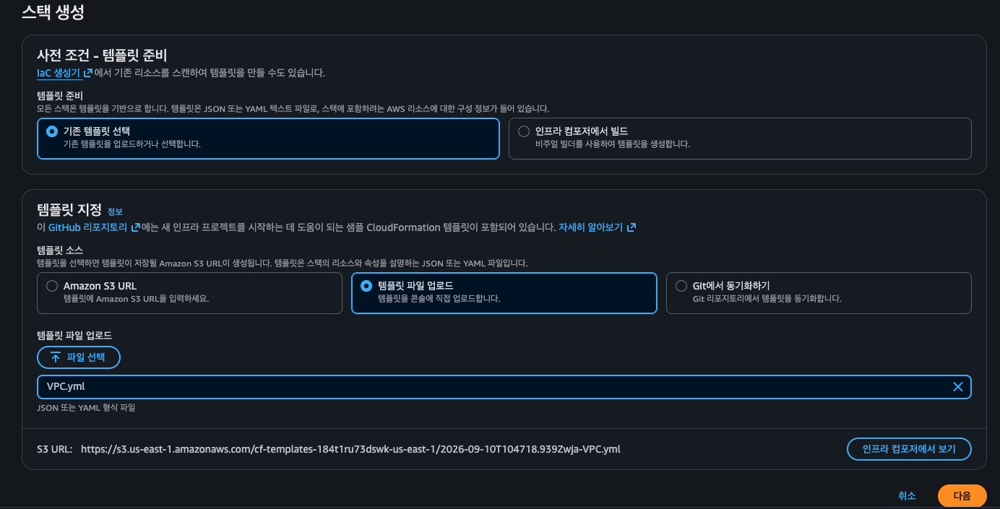
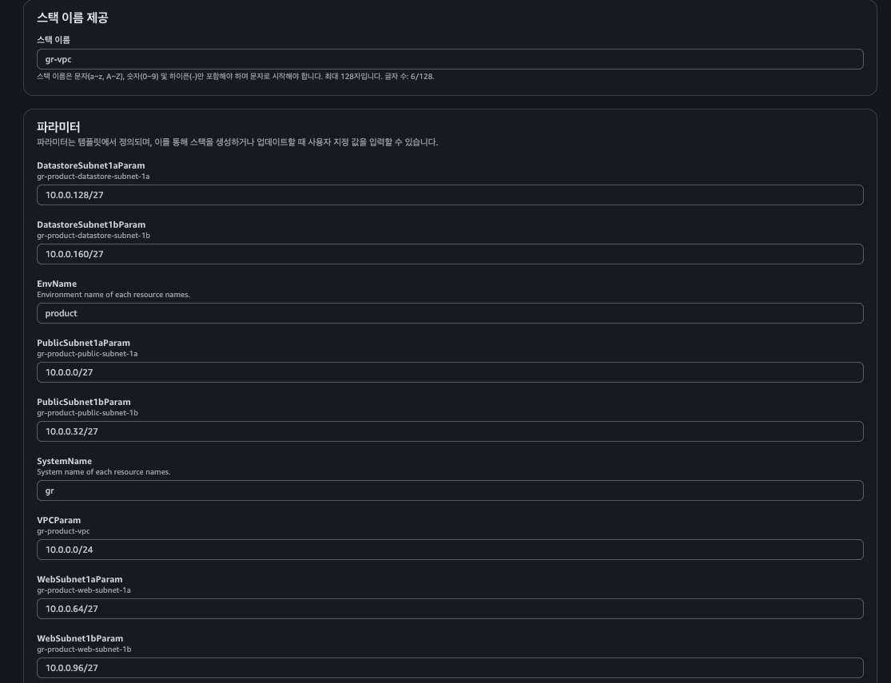
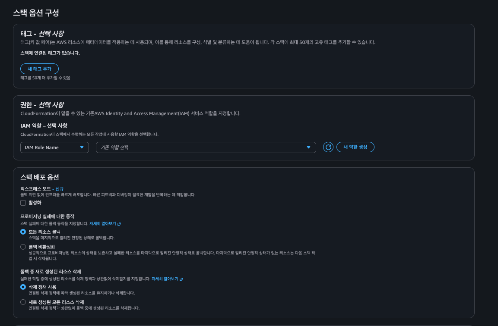
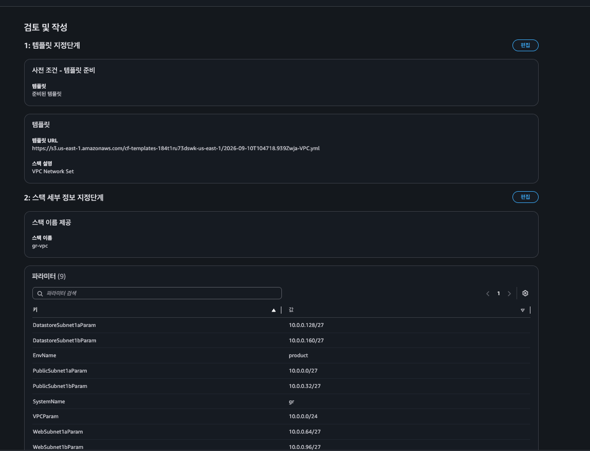
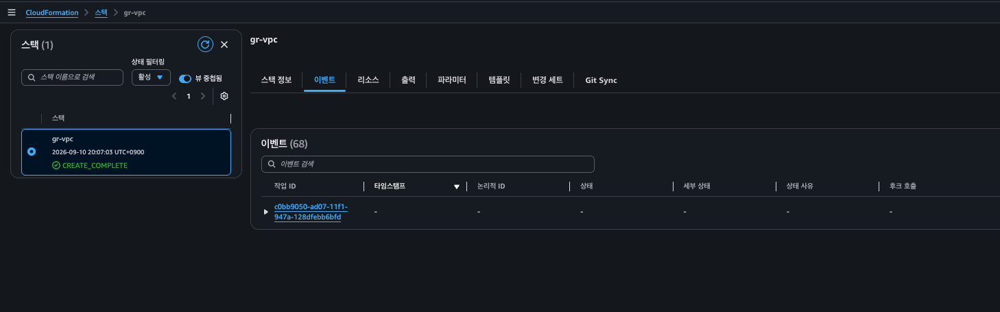
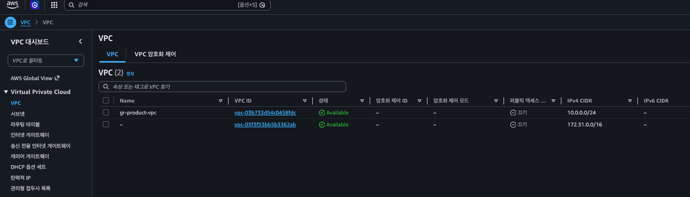

## AWS 루트 사용자

- **정의:** AWS 계정을 처음 생성할 때 사용한 이메일과 비밀번호로 로그인하는 주체입니다.
- **권한:** 해당 AWS 계정 내의 **모든 AWS 서비스와 리소스에 대한 완전한 제어 권한**을 가집니다.
- **보안 주의사항:** 일상적인 작업에는 절대 사용하지 말고, 최초 계정 생성 후 즉시 MFA(다중 인증)를 설정한 뒤 안전한 곳에 봉인해 두어야 합니다. 일반 작업은 IAM 사용자나 역할(Role)을 생성하여 사용하는 것이 원칙입니다.

## 레벨별 AWS 사용 방법

**레벨 1 (초급) - AWS 관리 콘솔 (Management Console)**

- **방식:** 웹 브라우저(GUI)를 통해 클릭과 마우스 조작으로 리소스를 생성하고 관리합니다.
- **특징:** 직관적이고 시각적이어서 AWS를 처음 배우거나 간단한 리소스를 확인할 때 가장 적합합니다.

레벨 2 (중급) - AWS CLI (Command Line Interface)

- **방식:** 터미널이나 명령 프롬프트에서 텍스트 명령어(`aws ec2 describe-instances` 등)를 입력해 제어합니다.
- **특징:** 반복적인 작업을 자동화하거나 스크립트를 작성하여 빠르게 처리할 때 유용합니다.

레벨 3 (상급) - AWS CloudFormation (인프라형 코드, IaC)

- **방식:** YAML 또는 JSON 파일로 인프라 전체 구조를 코드로 작성한 뒤, 이를 업로드하여 클라우드 환경을 통째로 구축 및 배포합니다.
- **특징:** 이번에 보신 템플릿처럼 복잡한 네트워크와 서버 구성을 일관성 있고 반복 가능하게 관리할 수 있습니다.

레벨 4 (최상급) - AWS SDK (소프트웨어 개발 키트)

- **방식:** Python, JavaScript, Java 등 **다양한 프로그래밍 언어**를 사용하여 코드 레벨에서 AWS API를 직접 호출합니다.
- **특징:** 애플리케이션 로직 내부에서 AWS 리소스(예: S3 파일 업로드, Lambda 실행 등)를 동적으로 제어하고 연동하는 완전한 맞춤형 환경을 구축합니다.

## CloudFormation 이란?

코드로 클라우드 서버와 데이터베이스 같은 AWS 리소스를 쉽게 만들고 관리하는 코드형 인프라(IaC) 서비스입니다. 사람이 직접 클릭해서 설정하지 않고 JSON이나 YAML 파일로 작성된 템플릿을 통해 인프라를 똑같이 빠르게 만들 수 있습니다

## CloudFormation에서 스택 생성하기

### VPC YAML

- AWS 클라우드 인프라를 코드로 정의하여 자동 생성하기 위한 AWS CloudFormation 템플릿(YAML 형식)입니다.

앞서 보신 스택 생성 마법사에서 입력하거나 기본값으로 설정한 네트워크 리소스들을 실제로 AWS 상에 구축하기 위한 설계도라고 보시면 됩니다. 이 템플릿이 수행하는 주요 역할은 다음과 같습니다.

- **VPC 및 서브넷 생성:** `10.0.0.0/24` 대역의 VPC를 만들고, 그 안에 퍼블릭 서브넷, 웹 서브넷, 데이터스토어 서브넷을 각각 2개 가용 영역(1a, 1b)에 나누어 총 6개의 서브넷으로 분할합니다.
- **인터넷 게이트웨이(IGW) 연결:** 외부 인터넷과 통신할 수 있도록 인터넷 게이트웨이를 만들고 VPC에 부착합니다.
- **라우팅 테이블(Route Table) 설정:** 퍼블릭, 웹, 데이터스토어용 라우팅 테이블을 각각 생성하고 각 서브넷과 연결하여 트래픽 흐름을 제어합니다. 특히 퍼블릭 서브넷은 인터넷 게이트웨이를 통해 외부와 통신(`0.0.0.0/0`)할 수 있도록 라우트를 설정합니다.
- **값 내보내기(Outputs):** 생성된 VPC와 서브넷들의 ID를 다른 CloudFormation 템플릿(예: EC2나 RDS를 만드는 후속 스택)에서 참조할 수 있도록 외부에 내보냅니다.

이 값들은 일반적으로 고가용성을 위해 2개의 가용 영역(1a, 1b)으로 나누어진 멀티 AZ 아키텍처 환경에서, 각 리소스가 어느 네트워크 영역에 배치될지를 CloudFormation 템플릿에 전달하는 역할을 합니다.

| 파라미터 이름              | 설정된 값 또는 의미                        | 설명                                                                                                                         |
| -------------------------- | ------------------------------------------ | ---------------------------------------------------------------------------------------------------------------------------- |
| **DatastoreSubnet1aParam** | `gr-product-datastore-subnet-1a`           | 가용 영역(AZ) 1a에 위치한 데이터스토어(데이터베이스 등)용 서브넷의 이름 또는 ID                                              |
| **DatastoreSubnet1bParam** | `gr-product-datastore-subnet-1b`           | 가용 영역(AZ) 1b에 위치한 데이터스토어용 서브넷의 이름 또는 ID                                                               |
| **EnvName**                | `Environment name of each resource names.` | 리소스 명명 규칙에 사용되는 **환경 이름**(예: dev, stg, prd)을 지정하는 파라미터 (현재 텍스트에는 템플릿 설명 문구가 노출됨) |
| **PublicSubnet1aParam**    | `gr-product-public-subnet-1a`              | 가용 영역(AZ) 1a에 위치하며 외부 인터넷과 통신하는 **퍼블릭 서브넷**의 이름 또는 ID                                          |
| **PublicSubnet1bParam**    | `gr-product-public-subnet-1b`              | 가용 영역(AZ) 1b에 위치하며 외부 인터넷과 통신하는 **퍼블릭 서브넷**의 이름 또는 ID                                          |
| **SystemName**             | `System name of each resource names.`      | 리소스 명명 규칙에 사용되는 **시스템 또는 프로젝트 이름**을 지정하는 파라미터 (현재 텍스트에는 템플릿 설명 문구가 노출됨)    |
| **VPCParam**               | `gr-product-vpc`                           | 리소스들이 배치될 기본 가상 사설 클라우드 네트워크인 **VPC**의 이름 또는 ID                                                  |
| **WebSubnet1aParam**       | `gr-product-web-subnet-1a`                 | 가용 영역(AZ) 1a에 위치한 웹 서버 계층용 서브넷의 이름 또는 ID                                                               |
| **WebSubnet1bParam**       | `gr-product-web-subnet-1b`                 | 가용 영역(AZ) 1b에 위치한 웹 서버 계층용 서브넷의 이름 또는 ID                                                               |

